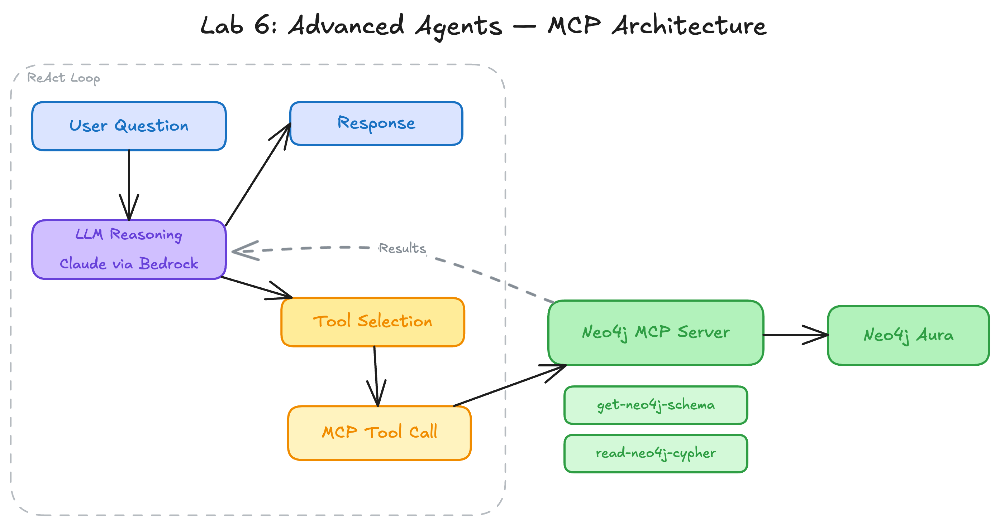

<style>
section {
  --marp-auto-scaling-code: false;
}

li {
  opacity: 1 !important;
  animation: none !important;
  visibility: visible !important;
}

/* Disable all fragment animations */
.marp-fragment {
  opacity: 1 !important;
  visibility: visible !important;
}

ul > li,
ol > li {
  opacity: 1 !important;
}
</style>

# Agents and MCP

The ReAct Pattern, Strands SDK, and Model Context Protocol

---

## Why Agents?

Foundation models have gaps:
- **No tool access** — cannot query databases or call APIs on their own
- **No private data** — trained on public data, not your knowledge graph
- **Static knowledge** — training data has a cutoff date

**Agents** bridge these gaps by giving LLMs the ability to **reason about what to do** and **act by calling tools**. The model decides which tool to call, interprets the result, and decides what to do next.

---

## The ReAct Pattern

**ReAct** = Reason + Act. Every agent in this workshop follows this loop:

1. **Reason**: The LLM examines the question and current state
2. **Act**: The LLM issues a tool call (or produces a final answer)
3. **Observe**: The tool executes and the result is appended
4. **Repeat**: The LLM decides whether to call another tool or finish

The number of cycles depends on the question's complexity, not a predetermined plan.

---

## ReAct Example: SEC Data

**User**: "What risks does NVIDIA face and which asset managers are exposed?"

**Cycle 1** — Reason: need NVIDIA's risk factors → Act: query graph → Observe: Supply Chain Disruption, Cybersecurity Threats

**Cycle 2** — Reason: need asset managers holding NVIDIA → Act: query graph → Observe: BlackRock, Vanguard, State Street

**Synthesize**: "NVIDIA faces supply chain and cybersecurity risks. BlackRock, Vanguard, and State Street hold positions, making their portfolios exposed."

---

## Strands Agents SDK

AWS-native agent framework. **Model-driven**: the model decides what to do, not developer-defined control flow.

```python
from strands import Agent
from strands.models import BedrockModel
from strands.tools import tool

bedrock_model = BedrockModel(
    model_id=MODEL_ID,
    region_name=REGION,
    temperature=0,
)

agent = Agent(
    model=bedrock_model,
    system_prompt="You are a helpful assistant.",
    tools=[get_current_time, add_numbers],
)
```

---

## Tools with the @tool Decorator

Tools are Python functions the LLM can call. The docstring becomes the tool description:

```python
@tool
def get_current_time() -> str:
    """Get the current date and time."""
    return datetime.now().strftime("%Y-%m-%d %H:%M:%S")
```

The LLM reads the tool descriptions, decides which to call based on the question, and interprets the result. You define *capabilities*; the model coordinates their use.

---

## Model Context Protocol (MCP)

**MCP** is an open standard that defines how AI agents discover and interact with external tools:

```
AI Agent (Client)  ←→  MCP Server  ←→  Data Source
```

- **Agent** discovers available tools by asking the MCP server
- **MCP Server** translates between protocol and native API
- **Data Source** (Neo4j, REST API, file system) holds the data

Any MCP-compatible agent connects to any MCP-compatible server.

---



---

## Neo4j MCP Server Tools

The Neo4j MCP Server exposes two tools (read-only mode):

| Tool | Description |
|------|-------------|
| **`get-schema`** | Reads the graph schema via APOC — node labels, relationship types, properties. Token-efficient format for LLM consumption. |
| **`read-cypher`** | Executes a read-only Cypher query. Runs `EXPLAIN` first to verify no write operations (CREATE, MERGE, DELETE, SET). |

The agent discovers these tools automatically through the MCP protocol.

---

## AWS Deployment Architecture

```
Agent (Notebook)  →  AgentCore Gateway (HTTPS)  →  Neo4j MCP Server  →  Neo4j Aura
                            ↑
                     Secrets Manager
                     (Neo4j credentials)
```

- **AgentCore Gateway**: AWS-managed HTTPS endpoint, authenticates and routes
- **Neo4j MCP Server**: read-only, Streamable HTTP transport
- **Secrets Manager**: stores Neo4j credentials, retrieved at runtime

All pre-deployed. You connect with a URL and access token from `CONFIG.txt`.

---

## Cypher Templates (Lab 5, Notebook 02)

Pre-written queries wrapped in `@tool` functions:

```python
@tool
def search_company_risks(company_name: str) -> str:
    """Search for risk factors facing a specific company."""
    cypher = """
    MATCH (c:Company {name: $name})-[:FACES_RISK]->(r:RiskFactor)
    RETURN r.name AS risk
    """
    return mcp_client.execute("read-cypher", cypher, {"name": company_name})
```

The agent **selects** which template to execute. The queries are expert-reviewed and deterministic.

---

## Text2Cypher (Lab 5, Notebook 03)

The agent writes its own Cypher from scratch after schema discovery:

1. **Retrieve the schema** — call `get-schema` to learn labels, types, properties
2. **Write a Cypher query** — based on the actual schema, not assumptions
3. **Execute the query** — call `read-cypher` with the generated Cypher

The agent can answer **any question the schema supports**, but query quality depends on LLM reasoning.

---

## Schema-First Approach

**Without schema**: LLM guesses `MATCH (c:Corp)-[:HAS_PRODUCT]->(p)` — label `Corp` does not exist, `HAS_PRODUCT` is not a relationship type. Query returns zero results silently.

**With schema**: Agent sees actual labels (`Company`, `Product`) and types (`OFFERS`, `FACES_RISK`). Generated Cypher uses the correct vocabulary.

The schema step is critical. Empty results genuinely mean no matching data rather than a query targeting non-existent elements.

---

<style scoped>
section { font-size: 25px; }
</style>

## Cypher Templates vs Text2Cypher

| Aspect | Cypher Templates | Text2Cypher |
|--------|-----------------|-------------|
| **Cypher source** | Pre-written in `@tool` functions | Agent writes from scratch |
| **Schema discovery** | No; queries use known labels | Yes; agent calls `get-schema` first |
| **Flexibility** | Limited to defined patterns | Any question the schema supports |
| **Failure mode** | Predictable, expert-reviewed | Silent failures possible |
| **MCP role** | Transport for pre-written queries | Discovery (schema) + execution |
| **Best for** | Known patterns, high reliability | Ad-hoc exploration |

---

## The Reliability Spectrum

```
More Reliable                                    More Flexible
←─────────────────────────────────────────────────────────→

Cypher Templates          VectorCypherRetriever          Text2Cypher
(pre-written,             (pre-written traversal,        (agent-generated,
 deterministic)            vector-driven anchor)          schema-driven)
```

Production systems typically use templates for known patterns and Text2Cypher for the long tail.

---

## Why a Specialized Graph Agent

An agent handling both SQL and Cypher in one prompt must hold:
- Two query languages
- Two data models
- Two sets of conventions

Mixing dilutes focus. The graph agent in this workshop handles **only graph queries**: inspect schema, write Cypher, execute it.

In production, a **supervisor agent** routes questions to specialists: relationship traversals go to the graph agent, aggregations go to a SQL agent.

---

## AgentCore Deployment (Lab 3)

Lab 3 deploys a Strands agent to **AgentCore Runtime**:

1. Agent code (`agent.py`) + dependencies (`pyproject.toml`) in `agentcore_deploy/`
2. Generate `.bedrock_agentcore.yaml` configuration
3. Run `agentcore deploy` — packages, uploads to S3, creates microVM
4. Invoke via `agentcore` CLI or boto3

Each session runs in an **isolated microVM** — dedicated CPU, memory, filesystem. Terminated and sanitized after completion.

---

## Lab 5 Notebook Progression

**Notebook 01: Intro to Strands MCP**
MCP tool discovery, schema inspection, simple queries

**Notebook 02: Graph-Enriched Search**
Cypher Templates pattern — `@tool` wrappers with vector search + graph traversal via MCP

**Notebook 03: Text2Cypher Agent**
Full autonomy — agent reads schema and writes its own Cypher

---

## Summary

- **ReAct pattern**: reason, act, observe, repeat — foundation for all workshop agents
- **Strands SDK**: model-driven, AWS-native, built-in MCP support
- **MCP**: open standard for agent-to-tool connectivity
- **Cypher Templates**: reliable, pre-written queries via MCP
- **Text2Cypher**: flexible, agent-generated queries after schema discovery
- **Schema-first**: critical for accurate Cypher generation
- **AgentCore**: serverless deployment with session isolation

The agents use the knowledge graph from Labs 1-4 as their intelligence layer.
