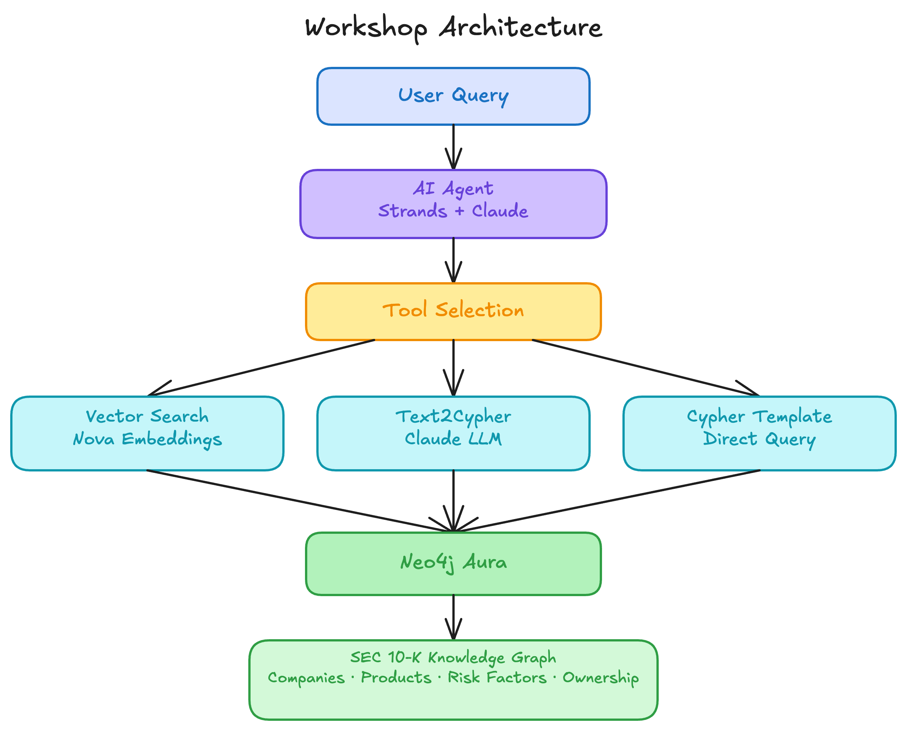

<style>
section {
  --marp-auto-scaling-code: false;
}

li {
  opacity: 1 !important;
  animation: none !important;
  visibility: visible !important;
}

/* Disable all fragment animations */
.marp-fragment {
  opacity: 1 !important;
  visibility: visible !important;
}

ul > li,
ol > li {
  opacity: 1 !important;
}
</style>

# GraphRAG with Neo4j, AWS Bedrock & Databricks

Building Knowledge Graph-Powered AI Agents

---

## What You Will Build

- A **knowledge graph** from SEC 10-K financial filings, loaded from governed Databricks tables via the Spark Connector
- **GraphRAG retrieval pipelines** that combine vector search with graph traversal
- **AI agents** that query the knowledge graph

By the end, an agent can answer: "Which risk factors expose BlackRock's portfolio across multiple companies?" by traversing ownership chains and risk relationships in the graph.

---

## Why Neo4j + AWS + Databricks?

Three platforms solve **different problems well**.

**AWS** provides managed foundation models (Bedrock), development environments (SageMaker), and serverless agent hosting (AgentCore).

**Neo4j** provides a native graph database that stores entities and relationships as first-class structures, with built-in vector search and graph traversal.

**Databricks** provides the lakehouse platform that governs and pipelines enterprise data into the knowledge graph through the Neo4j Spark Connector.

Together: Databricks aggregates and governs enterprise data, Neo4j makes relationships traversable for retrieval, and Bedrock provides the reasoning and generation layer.

---



---

## Data Pipeline: Databricks to Neo4j

The SEC 10-K data flows from **Databricks** to **Neo4j** through the Neo4j Spark Connector:

- Governed Delta tables in the lakehouse, refined through the **medallion pattern** (bronze, silver, gold)
- The Spark Connector reads from silver tables and writes nodes and relationships into the knowledge graph
- Table rows become nodes, foreign keys become relationships, shared attributes become shared nodes

This workshop's knowledge graph is **pre-loaded**. You work directly with the populated graph from Lab 1 onward.

---

## The SEC Financial Data Domain

Public companies file **10-K annual reports** with the Securities and Exchange Commission. These filings contain:

- Business operations and product descriptions
- Risk factor disclosures
- Financial results and executive information
- Institutional ownership data

The workshop builds a knowledge graph from this data, connecting companies, products, risk factors, and asset managers.

---

## The Knowledge Graph Schema

```
(Company)-[:OFFERS]->(Product)
(Company)-[:FACES_RISK]->(RiskFactor)
(Company)-[:COMPETES_WITH]->(Company)
(Company)-[:PARTNERS_WITH]->(Company)
(AssetManager)-[:OWNS {shares}]->(Company)
```

Four entity types connected by typed relationships that reflect real-world structure. Multi-hop questions follow the connections directly.

---


---

## Workshop Architecture

| Layer | Technology | Purpose |
|-------|-----------|---------|
| **Data Pipeline** | Databricks + Neo4j Spark Connector | Govern, refine, and load enterprise data into the graph |
| **Knowledge Graph** | Neo4j Aura | Store entities, relationships, vector embeddings |
| **Reasoning** | Anthropic Claude (via Bedrock) | Tool selection, response generation |
| **Embeddings** | Amazon Nova (via Bedrock) | Vector representations for semantic search |
| **Development** | SageMaker Studio | JupyterLab notebooks |
| **Agent Hosting** | AgentCore Runtime | Serverless agent deployment |
| **Tool Protocol** | MCP (Model Context Protocol) | Agent-to-graph connectivity |

---

## Workshop Roadmap

**Part 1: Setup & Visual Exploration** (Labs 0-2)
Sign in to AWS, provision Neo4j Aura, load the knowledge graph, build a no-code agent with Aura Agents

**Part 2: Building GraphRAG Agents** (Labs 3-5)
Amazon Bedrock and Strands SDK, vector search and graph-enriched retrieval with neo4j-graphrag, MCP agents with Cypher Templates and Text2Cypher

**Part 3: Bonus — Build Your Own Pipeline** (Lab 6)
Build the GraphRAG data pipeline from scratch: data loading, embeddings, and vector-cypher retrieval

---

## Lab Progression

| Lab | Focus | Key Concept |
|-----|-------|-------------|
| **0** | AWS sign-in, Bedrock access | Foundation model access |
| **1** | Neo4j Aura setup, data loading | Graph databases, Cypher |
| **2** | Aura Agents (no-code) | Retrieval patterns preview |
| **3** | Strands SDK, Bedrock agents | ReAct pattern, tool use |
| **4** | neo4j-graphrag retrievers | Vector + graph-enriched search |
| **5** | MCP server, Text2Cypher | Schema-first agent queries |
| **6** | Full data pipeline (bonus) | Chunking, embeddings, indexing |

---

## From No-Code to Full Autonomy

The labs progress along a **control spectrum**:

```
Lab 2: Aura Agents        → No code, auto-generated tools
Lab 3: Strands SDK         → Code-first agents, @tool decorator
Lab 4: neo4j-graphrag      → Pre-built retriever classes
Lab 5: Cypher Templates    → Pre-written queries, MCP transport
Lab 5: Text2Cypher         → Agent writes its own Cypher
```

Each step gives the agent more autonomy. The trade-off: more flexibility means less predictability.

---

## What Each Platform Brings

| | AWS | Neo4j | Databricks |
|---|-----|-------|------------|
| **Provides** | Models, compute, hosting | Graph storage, vector index, query engine | Data governance, pipelines, lakehouse |
| **Answers** | "Generate a response" and "Deploy this agent" | "How is this connected?" and "What is semantically similar?" | "How much?" and "How often?" |
| **AI capability** | Bedrock (Claude, Nova), AgentCore | Vector indexes, GraphRAG, MCP Server | Mosaic AI, Genie (natural language SQL) |
| **Strength** | Scale, managed services, security | Relationships, traversal, pattern matching | Aggregations, governance, data pipelines |

---

## Prerequisites

- **AWS account** with Bedrock access (provided for instructor-led workshops)
- **Neo4j Aura** account (free tier or provided OneBlink SSO)
- **No local setup required** — all work happens in SageMaker Studio notebooks

Let's get started with Lab 0.
