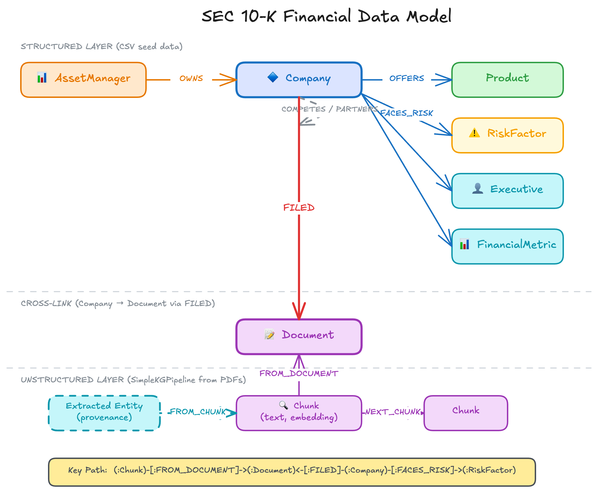

<style>
section {
  --marp-auto-scaling-code: false;
}

li {
  opacity: 1 !important;
  animation: none !important;
  visibility: visible !important;
}

/* Disable all fragment animations */
.marp-fragment {
  opacity: 1 !important;
  visibility: visible !important;
}

ul > li,
ol > li {
  opacity: 1 !important;
}
</style>

# Knowledge Graph Foundations

Graph Databases, Cypher, and the SEC Financial Knowledge Graph

---

## What Is a Graph Database?

A graph database models data as **nodes** and **relationships**.

- **Nodes** represent entities (companies, products, risk factors)
- **Relationships** represent connections (OFFERS, FACES_RISK, OWNS)
- **Properties** are key-value pairs on both nodes and relationships

Connections are **stored as first-class structures**, not computed at query time through joins.

---

## Graph Notation

Parentheses denote nodes. Brackets denote relationships:

```
(:Company {name, ticker})-[:FACES_RISK]->(:RiskFactor {name})
```

Each Company node carries properties like `name` and `ticker`. Each FACES_RISK relationship connects a company to its risk factor. The relationship is directional, typed, and stored alongside the nodes it connects.

---

## Graphs vs Relational Databases

**"Which risk factors expose BlackRock's portfolio?"**

**Relational (SQL):** Join through ownership junction table to companies, then through risk factor junction table to risk factors, group and count across both joins.

**Graph (Cypher):**
```cypher
MATCH (am:AssetManager {name: 'BlackRock'})
      -[:OWNS]->(c:Company)
      -[:FACES_RISK]->(r:RiskFactor)
RETURN r.name, count(DISTINCT c) AS exposedCompanies
ORDER BY exposedCompanies DESC
```

The query reads like the traversal it executes.

---

## Cypher Query Language

Cypher uses **pattern-matching syntax** that mirrors graph structure:

```cypher
MATCH (c:Company {ticker: 'NVDA'})-[:OFFERS]->(p:Product)
RETURN p.name ORDER BY p.name LIMIT 10
```

- `MATCH` finds nodes and relationships that fit a pattern
- `(c:Company {ticker: 'NVDA'})` binds a Company node to variable `c`
- `-[:OFFERS]->` follows outbound OFFERS relationships
- `RETURN` selects which properties to include in results

---

## The SEC Financial Knowledge Graph

Four core entity types from SEC 10-K filings:

| Entity Type | Examples |
|-------------|----------|
| **Company** | NVIDIA, Microsoft, Apple, Amazon, Tesla, JPMorgan Chase |
| **Product** | GPUs, Cloud Services, iPhone, AWS, Model S |
| **RiskFactor** | Supply Chain Disruption, Regulatory Compliance, Cybersecurity Threats |
| **AssetManager** | BlackRock, Vanguard, State Street, Fidelity |

---

## Relationships in the Graph

```
(Company)-[:OFFERS]->(Product)
(Company)-[:FACES_RISK]->(RiskFactor)
(Company)-[:COMPETES_WITH]->(Company)
(Company)-[:PARTNERS_WITH]->(Company)
(AssetManager)-[:OWNS {shares}]->(Company)
```

**Company** is the central hub. Most relationships radiate from it: companies offer products, face risks, compete, partner, and are owned by asset managers.

---



---

## Why This Schema Design

**Separate relationship types** rather than generic RELATES_TO:

- `COMPETES_WITH` and `PARTNERS_WITH` are distinct types
- Cypher filters by relationship type during traversal, which is indexed and fast
- A property filter on a generic relationship requires checking every connection

**Typed relationships** let traversal patterns follow specific paths efficiently.

---

## Multi-Hop Queries

The graph answers questions that require traversing multiple connections:

```cypher
MATCH (am:AssetManager {name: 'BlackRock'})
      -[:OWNS]->(c:Company)
      -[:FACES_RISK]->(r:RiskFactor)
RETURN r.name, count(DISTINCT c) AS companies
ORDER BY companies DESC
```

Three hops: AssetManager → Company → RiskFactor. Each hop follows stored connections rather than computing joins.

---

## Neo4j Aura

Neo4j Aura is the **fully managed cloud graph database** used in this workshop:

- Automatic backups and high availability
- Built-in **vector indexes** for semantic search
- Built-in **fulltext indexes** for keyword search
- **Graph Data Science** algorithms (PageRank, community detection)
- Deployed on AWS, GCP, or Azure

---

## Aura Developer Tools

**Query** — Cypher editor with syntax highlighting and auto-completion. Used to load data and verify results.

**Explore** (Neo4j Bloom) — Visual graph exploration. Search for nodes, expand relationships, discover patterns on an interactive canvas.

**Dashboards** — Low-code visualization: bar charts, geographic maps, and graph visualizations for non-technical stakeholders.

---

## Aura Agents (Lab 2 Preview)

Neo4j's **no-code agent platform** for conversational AI:

- "Create with AI" inspects your graph schema and auto-generates tools
- **Cypher Templates**: deterministic, pre-built traversal patterns
- **Text2Cypher**: flexible natural language to Cypher at runtime
- **Similarity Search**: vector-based matching (requires embeddings)
- Deploy as REST API or MCP Server endpoint

---

## Data Loading Pattern

Lab 1 loads the knowledge graph using Cypher:

1. **Create constraints** for uniqueness (Company by ticker, Product by name)
2. **MERGE nodes** — create if not exists, match if it does
3. **MERGE relationships** — connect entities with typed relationships

```cypher
MERGE (c:Company {ticker: row.ticker})
SET c.name = row.name, c.sector = row.sector
```

Constraints make MERGE efficient: Neo4j uses the index instead of scanning all nodes.

---

## Constraints and Indexes

```cypher
CREATE CONSTRAINT company_ticker IF NOT EXISTS
FOR (c:Company) REQUIRE c.ticker IS UNIQUE
```

**Constraints** prevent duplicate nodes and enable efficient MERGE operations.

**Vector indexes** store embeddings for semantic search (Labs 4-6):
```cypher
CREATE VECTOR INDEX chunkEmbeddings IF NOT EXISTS
FOR (c:Chunk) ON (c.embedding)
OPTIONS {indexConfig: {`vector.dimensions`: 1024,
         `vector.similarity_function`: 'cosine'}}
```

---

## What Comes Next

- **Lab 1**: Provision Aura, load the structured graph, explore visually
- **Lab 2**: Build a no-code agent with Aura Agents
- **Lab 4**: Add the unstructured layer (chunks + embeddings), run GraphRAG retrievers
- **Lab 5**: Connect agents to the graph via MCP
- **Lab 6**: Build the entire data pipeline from scratch

The knowledge graph is the foundation for everything that follows.
